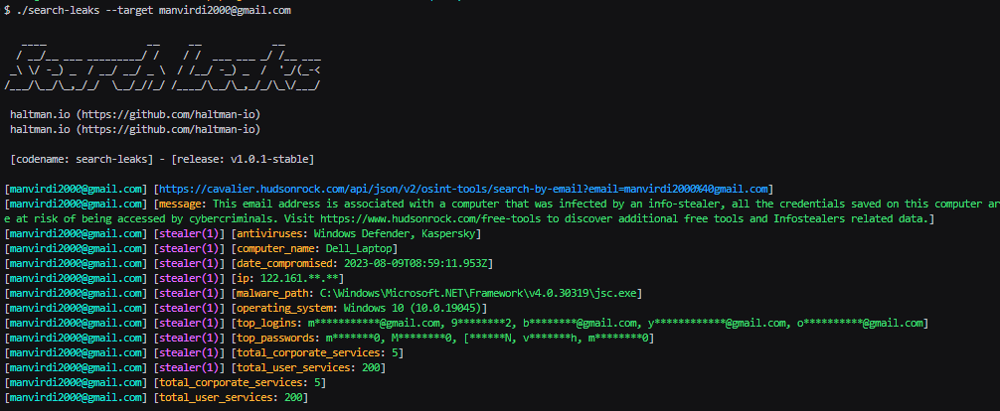
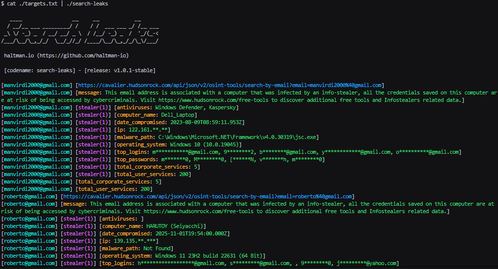

# search-leaks

OSINT-focused CLI tool to query **data leak / breach statistics** for **domains** and **email addresses** using public threat-intel APIs (Hudson Rock Cavalier OSINT endpoints). Designed for cybersecurity assessments, vendor risk reviews, and due diligence workflows.

Repository: [https://github.com/haltman-io/search-leaks](https://github.com/haltman-io/search-leaks)

---

## Why this exists

Security teams often need a fast, repeatable way to check whether a company (or a specific mailbox) shows signs of credential exposure or info-stealer-related risk, **without collecting or storing sensitive breach payloads**. This tool consumes **statistical JSON** responses and prints a **structured, greppable** output.

---

## Features

* Query by **domain** or **email**
* Multiple target input methods:

  * `stdin` / pipeline
  * `--target/-t` (repeatable and comma-separated)
  * `--target-list/-tL` (repeatable and comma-separated file paths)
* Modes:

  * **Automatic** (default): detects domain vs email per target
  * **Domain forced**: emails are converted to their domain
  * **Email forced**: domains expand into common mailbox aliases (e.g., `postmaster@domain`)
* Rate limit aware: **50 requests / 10 seconds**
* Fails fast: aborts after **3 consecutive API errors**
* Colored output (ANSI), disable with `--no-color/-nc`
* Debug logging: `--verbose/-v` or `--debug`

---

## Screenshot / Demo





---

## Data source / Endpoints

This tool queries the following public endpoints:

* Domain:

  * `https://cavalier.hudsonrock.com/api/json/v2/osint-tools/search-by-domain?domain=<TARGET>`
* Email:

  * `https://cavalier.hudsonrock.com/api/json/v2/osint-tools/search-by-email?email=<TARGET>`

---

## Installation

### Option A) Build from source (recommended)

**Requirements**

* Go **1.22+**

```bash
git clone https://github.com/haltman-io/search-leaks.git
cd search-leaks
go mod tidy
go build -o search-leaks ./cmd/search-leaks
```

Run it:

```bash
./search-leaks -h
```

### Option B) Install to `$GOBIN`

```bash
go install github.com/haltman-io/search-leaks/cmd/search-leaks@latest
search-leaks -h
```

> If `search-leaks` is not found, ensure `$GOBIN` (or `$(go env GOPATH)/bin`) is in your `PATH`.

---

## Usage

### Flags

**Targets**

* `--target, -t <target>`: define a target (repeatable; supports comma-separated values)
* `--target-list, -tL <file>`: define a file of targets (repeatable; supports comma-separated paths)
* `stdin` / pipeline: `cat targets.txt | search-leaks`

**Modes (only one allowed)**

* `--automatic, -a` (default): auto-detect target type per item
* `--domain, -d`: force domain endpoint for all items
* `--email, -e`: force email endpoint for all items

**Output & logging**

* `--silent, -s`: results only (no banner)
* `--quiet, -q`: results only (no banner)
* `--verbose, -v`: debug logs (stderr)
* `--debug`: debug logs (stderr)
* `--no-color, -nc`: disable ANSI output

---

## Input formats

### 1) Single target

```bash
./search-leaks -t google.com
./search-leaks -t manvirdi2000@gmail.com
```

### 2) Multiple `-t` targets

```bash
./search-leaks -t google.com -t twitter.com
```

### 3) Comma-separated targets

```bash
./search-leaks -t google.com,twitter.com
```

### 4) List files (`-tL`)

```bash
./search-leaks -tL targets1.txt -tL targets2.txt
./search-leaks -tL targets1.txt,targets2.txt
```

### 5) Pipeline / stdin

```bash
cat targets.txt | ./search-leaks
cat targets.txt | ./search-leaks -a
```

---

## Modes behavior

### Automatic mode (default)

Each target is inspected:

* if it looks like an email → query **email endpoint**
* otherwise → query **domain endpoint**

```bash
./search-leaks -t example.com -t user@example.com
```

### Forced domain mode (`--domain/-d`)

All items are treated as **domain queries**:

* if the item is an email, the domain portion is extracted and queried

```bash
./search-leaks -d -t user@corp.com
```

### Forced email mode (`--email/-e`)

All items are treated as **email queries**:

* if the item is a domain, it is expanded into:

  * `postmaster@domain`, `abuse@domain`, `hostmaster@domain`, `webmaster@domain`,
    `admin@domain`, `administrator@domain`, `root@domain`

```bash
./search-leaks -e -t example.com
```

---

## Output format

The tool prints structured lines intended for quick reading and easy parsing:

```text
[target] [request_url]
[target] [key: value]
[target] [arrayItem(1)] [key: value]
```

Example (email query with arrays):

```text
[user@example.com] [https://.../search-by-email?email=user%40example.com]
[user@example.com] [total_corporate_services: 5]
[user@example.com] [stealer(1)] [operating_system: Windows 10 (10.0.19045)]
[user@example.com] [stealer(1)] [antiviruses: Windows Defender, Kaspersky]
```

Example (domain query):

```text
[example.com] [https://.../search-by-domain?domain=example.com]
[example.com] [employees: 0]
[example.com] [users: 0]
```

---

## Rate limiting & failure policy

* Throttles requests to respect **50 requests per 10 seconds**
* Aborts after **3 consecutive API errors** (any non-2xx HTTP status, network errors, or JSON parse failures)

  * A successful request resets the consecutive error counter

---

## Security & Privacy Notes

* This tool is intended for **authorized security testing** and **vendor due diligence**.
* It consumes **statistical JSON output** from a public endpoint and prints it to stdout.
* Do not use this tool to target individuals or organizations without authorization.

---

## Contributing

### Development setup

```bash
git clone https://github.com/haltman-io/search-leaks.git
cd search-leaks
go mod tidy
```

### Project layout

* `cmd/search-leaks/`: CLI entrypoint
* `internal/cli/`: flags, usage, mode resolution
* `internal/targets/`: target collection, detection, expansion logic
* `internal/api/`: HTTP client and endpoint definitions
* `internal/ratelimit/`: rate limiting utilities
* `internal/output/`: banner, colors, JSON flattening and printing

### Guidelines

* Keep comments, identifiers, and logs **in English**
* Prefer small, testable functions and clear packages
* Avoid breaking output format unless justified (and document changes)
* When adding new APIs/providers, keep the interface modular:

  * do not hardcode provider assumptions in unrelated packages
  * add provider logic behind `internal/api/` and keep formatting stable in `internal/output/`

### Pull Requests

* Open a PR with a clear summary, motivation, and examples
* If you change output, include **before/after snippets**
* Add/adjust documentation if behavior changes

---

## Vulnerability Reporting (Security)

If you discover a security issue in this repository:

1. **Do not open a public GitHub issue.**
2. Send a report with:

   * a clear description of the issue
   * impact assessment
   * reproduction steps / PoC (if applicable)
   * suggested remediation
3. Contact:

   * Create a private advisory (recommended) via GitHub Security Advisories (if enabled), **or**
   * Email the maintainers (add an email here)

> **Maintainer security contact (TODO):** add `security@haltman.io` or an appropriate mailbox.

---

## License

This project is licensed under the Unlicense, see the [LICENSE](LICENSE) file for details.